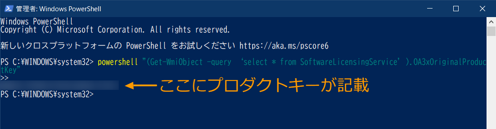

# 作業手順

## プロダクトキーの確認

PowerShellを使って確認。以下のコマンド[^1][^2]を入力して確認した。
[^1]: [PC設定のカルマ](https://pc-karuma.net/windows-10-find-product-key/)
[^2]: [TheWindowsClub](https://www.thewindowsclub.com/find-windows-product-key)

```vb
powershell "(Get-WmiObject -query ‘select * from SoftwareLicensingService’).OA3xOriginalProductKey"
```



コマンドプロンプト（cmd）では以下のコマンドを使うらしい。

```vb
wmic path softwarelicensingservice get OA3xOriginalProductKey
```


> 上記のコマンドはどちらともOEM製のPCのみで使えるコマンドの模様。
> パッケージ版のWindows 10で試しても何も表示されなった。

## Windows Updateの確認

経験上、初期化するときでも最新版のWindowsにしておくと
トラブルに遭わなくて済むことが多かったので一応Windows Updateの確認とインストール。
1月分の更新プログラムがインストールされた。

## BitLockerの解除[^3]

初期化するときのトラブルを防ぐためにドライブの暗号化の解除。
なぜかBitLockerという名前で表示されなかった。
`[設定] > [更新とセキュリティ] > [デバイスの暗号化]`から「オフにする」を選択。
10分くらいで解除は終了。（ちなみに「オンにする」を押したら2秒くらいで有効になった。早すぎ。）


[^3]: [ドスパラ](http://faq3.dospara.co.jp/faq/show/8881?site_domain=default)

## ファイルのバックアップ

以下のフォルダーにあるファイルを確認。

- ダウンロード

> インストーラーはメインPCにバックアップがあるので無視。
> Wi-Fi関連のドライバーは昔トラブったから古いものを含めてすべてバックアップ。

- ドキュメント

> GitHubのローカルリポジトリがあるだけなので無視。

- ピクチャ

> 必要なものはすべてAmazon Photosにバックアップしているので無視。

## ライセンスが必要なソフトの解除

モバイルPCにはライセンスの解除が必要なソフトはとくに入っていなかった。
大学を卒業してもなぜかずっと使えていたOffice365とはお別れ。

## デバイスの清掃

久々に裏も開けて清掃。ネジはT5。
開けるときは密閉されているから道具がないと難しいかも。
こんなときに持っていて良かった、iSclach！


ホコリはスピーカーにわずかに付着している程度。
やっぱりファンレス構造は汚れづらいから優秀。
心配していたバッテリーの膨らみもなし。
最後はツメを引っ掛けて裏天板をはめてネジ止めして終了。

## 動作確認

作業が原因でぶっ壊していないか一応起動するか確認。
問題なく起動。

## 初期化

[設定] > [更新とセキュリティ] > [回復] > [このPCを初期状態に戻す]から「開始する」を選択。

追加の設定なるものが増えていた。ドライブのクリーニングの度合いを変更できる模様。

> 調べたら同じような選択が以前のWindows 10でもあった。見せ方が変わっただけっぽい。

初期化後起動すると以下のメッセージ。

```batchfile
A configuration change was requested to clear
this computer’s TPM (Trusted Platform Module)

WARNING: Clearing erases information stored on the TPM.
You will lose all created keys and access to data encrypted by these keys.

Press F1 = Accept
Press F2 = Reject
```

むかし「F1」を押して超めんどくさい目にあった記憶を思い出したので「F2」を選択。
通常通りWindowsのインストールが開始した。

TPM関連のセットアップは`Accept`でも良いという記事[^4]も
`Reject`を選んだほうが良いという記事[^5][^6]の両方を見かける。
ここはもう少し勉強が必要。ちなみにHPにはやる気のないドキュメント[^7]しか見つからなかった。

[^4]: [TIME TO LIVE FOREVER](https://unsolublesugar.com/20180316/012458/)
[^5]: [ドスパラ](http://umplaneta.com/hosino1/docs-hsn1/PC%E5%88%9D%E6%9C%9F%E5%8C%96.htm)
[^6]: [Dell](https://www.dell.com/community/Windows-10/Windows10-%E5%88%9D%E6%9C%9F%E5%8C%96%E6%96%B9%E6%B3%95-DELL%E8%A3%BD%E3%83%A1%E3%83%87%E3%82%A3%E3%82%A2-DELL-OS-Recovery-Tool%E3%81%A7%E4%BD%9C%E6%88%90%E3%83%A1%E3%83%87%E3%82%A3%E3%82%A2/td-p/6126304)
[^7]: [HP](http://h10032.www1.hp.com/ctg/Manual/c05807442)

## Windows 10のセットアップ

言語 => 日本語
コルタナが喋り始める。うっとおしいので速攻オフに。
住まい => 日本
キーボードレイアウト => Microsoft IME
2つめのキーボードレイアウト => スキップ
ネットワークに接続 => 家のWi-Fiに接続
使用規約 => 同意
> 2018/6に最終更新。結構古いバージョンのWindows 10か？

アカウントにサインイン => オフラインアカウント
左下の「制限付きエクスペリエンス」を選択

このPCを使うのはだれですか？=> FolioG1と入力

passwordと秘密の質問を設定。

アクティビティ履歴を～ => いいえ
デジタルアシスタントを利用する => 拒否
デバイスのプライバシー設定の選択 => すべていいえで「同意」

## Windows起動後

Windows Updateの取得
> 初回のセットアップ時にちゃんと最新のファイル拾ってほしい。

ソフトのインストール
Google Chrome（無意識）
Adobe Acrobat Reader
Musicsoft Downloader
HP SoftPaq Download Manager

デバイスの暗号化はなぜか有効化されていた。
初期化するときに`Reject`を選んだからかも。
