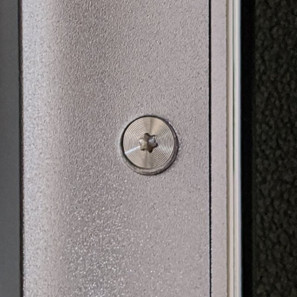
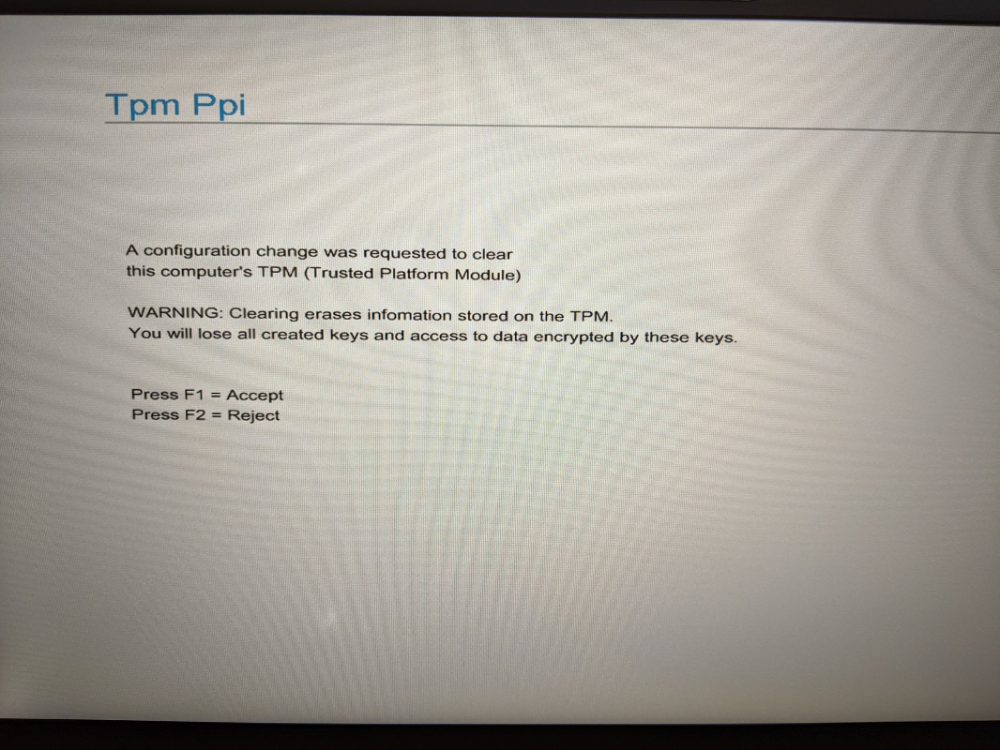

<!-- markdownlint-disable MD033 -->
# 作業手順

## 概要

Windows PCを渡すまでにやったことのメモ。

## プロダクトキーの確認

PowerShellを使って確認。以下のコマンド[^1][^2]を入力して確認した。
[^1]: [PC設定のカルマ](https://pc-karuma.net/windows-10-find-product-key/)
[^2]: [TheWindowsClub](https://www.thewindowsclub.com/find-windows-product-key)

```vb
powershell "(Get-WmiObject -query ‘select * from SoftwareLicensingService’).OA3xOriginalProductKey"
```


▲ PowerShellでの表示画面

コマンドプロンプト（cmd）では以下のコマンドを使って確認。
表示されるプロダクトキーは当然ながらPowerShellと同じもの。

```vb
wmic path softwarelicensingservice get OA3xOriginalProductKey
```


▲ コマンドプロンプトでの表示画面

> 上記のコマンドはどちらともOEM製のPCのみで使えるコマンドの模様。
> パッケージ版のWindows 10で試したが何も表示されなった。

## Windows Updateの確認

経験上、初期化するときでも最新版のWindowsにしておくとトラブルに遭わなくて済むことが多かったので
一応Windows Updateの確認とインストール。1月分の更新プログラムをインストール。

## BitLockerの解除[^3]

[^3]: [ドスパラ](http://faq3.dospara.co.jp/faq/show/8881?site_domain=default)

初期化するときのトラブルを防ぐためにドライブの暗号化の解除。
なぜかBitLockerとは表示されなかった。
`[設定] > [更新とセキュリティ] > [デバイスの暗号化]`から「オフにする」を選択。
10分くらいで解除は終了。


▲ 暗号化解除中の画面


▲ 暗号化解除後の画面

ここで「オンにする」を選択したら2秒くらいで暗号化が有効になる。

## ファイルのバックアップ

以下のフォルダーにあるファイルを確認。
ほとんどのファイルはクラウドにアップロードしているので基本的にバックアップは必要ない。

- ダウンロード
インストーラーはメインPCにバックアップがあるので無視。
Wi-Fi関連のドライバーは昔トラブったから古いものを含めてすべてバックアップ。
<br>
- ドキュメント
GitHubのローカルリポジトリがあるだけ。すべてGitHubにアップロードしているので無視。
<br>
- ピクチャ
必要なものはすべてAmazon Photosにバックアップしているので無視。

## アプリの設定のバックアップ

アプリの設定も基本はクラウドにアップロード済みなので確認なし。
KaleidaGraphとMeryは、むかしヘビーユーザーだったので結構カスタムしていたはず。
ただ、どちらも今はもう使っていないからバックアップはしない。

## ライセンスが必要なソフトの解除

このPCにはライセンスの解除が必要なソフトはとくに入っていなかった。
Office365は大学のときのアカウントなので解除する必要なし。

## デバイスの清掃

久々に裏も開けて清掃。ただしファンレスPCなので張り切っても対して掃除する必要はない。


▲ ネジはT5

開けるときは筐体と裏板が密着しているから道具がないと難しいかも。
こんなときにしか活躍できない[iSclack](https://jp.ifixit.com/Store/Tools/iSclack/IF145-243?o=1)、持ってて良かった。

▲ iSclackを使って御開帳


▲ 裏面カバーを外した状態

前述の通りファンレス仕様なのでホコリはスピーカーにわずかに付着している程度。
心配していたバッテリーの膨らみもないことを確認し、裏面カバーを閉じて終了。
最後に一度起動して正常に動作することを確認。

## 初期化

`[設定] > [更新とセキュリティ] > [回復] > [このPCを初期状態に戻す]`から「**開始する**」を選択。

▲ 初期化画面

人に渡すかどうかにかかわらず「**すべて削除**」を選ぶ派。

▲ オプションの選択

「追加の設定」の項目はドライブのクリーニングまで行なう方に設定。

▲ 追加の設定

さいごに「リセット」をクリックして初期化開始。

▲ リセット直前の画面


▲ リセット中の画面

初期化にかかった時間は45分。ストレージは256GBなので結構時間がかかっている印象。

▲ 初期化終了後の画面

初期化した後起動すると以下のメッセージ。

```batchfile
A configuration change was requested to Unlock
this computer’s TPM (Trusted Platform Module)

WARNING: Unlocking erases information stored on the TPM.
You will lose all created keys and access to data encrypted by these keys.

Press F1 = Accept
Press F2 = Reject
```


▲ TPMの初期化画面

むかし「F1」を押して起動のたびに物理セキュリティキーを要求されるという、
超めんどくさい目にあった記憶を思い出したので「**F2**」を選択。
通常通りWindowsのインストールが開始した。

> TPM関連のセットアップは`Accept`でも良いという記事[^4]も
> `Reject`を選んだほうが良いという記事[^5][^6]の両方を見かける。
> ここはもう少し勉強が必要。HPのサイトも探したけど、やる気のないドキュメント[^7]しか見つからなかった。

[^4]: [TIME TO LIVE FOREVER](https://unsolublesugar.com/20180316/012458/)
[^5]: [ドスパラ](http://umplaneta.com/hosino1/docs-hsn1/PC%E5%88%9D%E6%9C%9F%E5%8C%96.htm)
[^6]: [Dell](https://www.dell.com/community/Windows-10/Windows10-%E5%88%9D%E6%9C%9F%E5%8C%96%E6%96%B9%E6%B3%95-DELL%E8%A3%BD%E3%83%A1%E3%83%87%E3%82%A3%E3%82%A2-DELL-OS-Recovery-Tool%E3%81%A7%E4%BD%9C%E6%88%90%E3%83%A1%E3%83%87%E3%82%A3%E3%82%A2/td-p/6126304)
[^7]: [HP](http://h10032.www1.hp.com/ctg/Manual/c05807442)

## Windows 10のセットアップ

Windows 10の初期設定の方法はネットにいくらでもあるので選択した項目を羅列。

- 言語 => 日本語
- コルタナが喋り始めて不快なので左下の「マイク」からオフに。
- 住まい => 日本
- キーボードレイアウト => Microsoft IME
- 2つめのキーボードレイアウト => スキップ
- ネットワークに接続 => 家のWi-Fiに接続
- 使用規約 => 同意
- Microsoftアカウントでサインイン =>「オフラインアカウント」を選択

▲ オフラインアカウントの選択画面
<br>
- サインインして～、は左下の「制限付きエクスペリエンス」を選択

▲ 制限付きエクスペリエンスの選択画面
<br>

- このPCを使うのはだれですか？=> FolioG1
- パスワードと秘密の質問を設定

> いつもどおりムチャクチャな回答なので答えはUSBドライブに

- アクティビティ履歴を～ => いいえ
- デジタルアシスタントを利用する => 拒否
- デバイスのプライバシー設定の選択 => すべていいえで「同意」

▲ デバイスのプライバシー設定の選択

## Windows起動後

恒例の「こんにちは」画面のあとデスクトップ画面。超すっきり。

▲ 初回起動時のデスクトップ画面

デバイスの暗号化はなぜか有効化されていた。初期化するときにTPMの項目で`Reject`を選んだからかもしれない。

▲ デバイスの暗号化画面

### Windows Updateの取得

初回のセットアップの段階で取得されていない更新プログラムを適用。
2月分のアップデートまで適用した。

### Windows Storeアプリのアップデート

すべて最新版のアプリに更新。

### ソフトウェアのインストール

- Google Chrome（無意識）
- Adobe Acrobat Reader
- Musicsoft Downloader
- HP SoftPaq Download Manager
このソフトは以下のドライバーの更新に使用

### ドライバーのインストール

- DisplayLink Graphic Driver
トラベルドックを正常に動作させるために使用
<br>

- HP Hotkey Support
キーボード一番上のホットキーの動作に必要
<br>

- HP USB 3.0 Port Replicator and USB Travel Dock Driver
トラベルドックを正常に動作させるために使用
<br>

- Intel Thunderbolt 3 Firmware Update for HP Elitebook Folio G1
Thunderbolt 3[^8]という、USBとHDMIと充電端子をすべて1つにまとめたような機能を正常に使うために使用
<br>


- Intel Thunderbolt 3 Secure Connect
同上
[^8]: [StarTech.com](https://www.startech.com/jp/USB-C/Thunderbolt-3)

以上でWindowsの初期化、セットアップは終了。