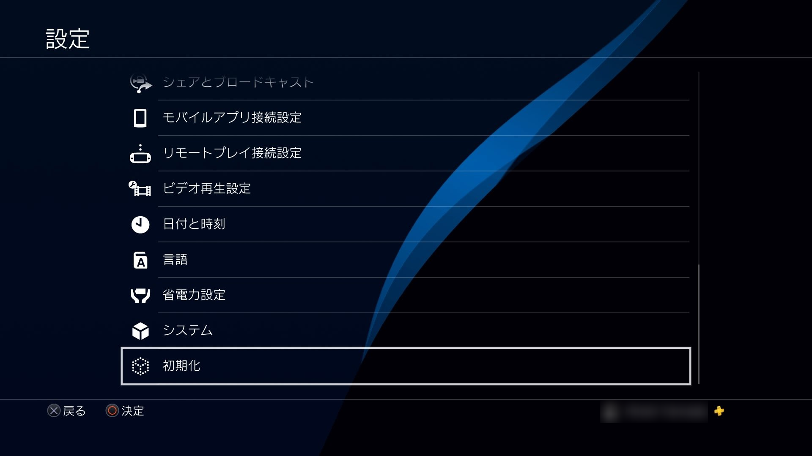
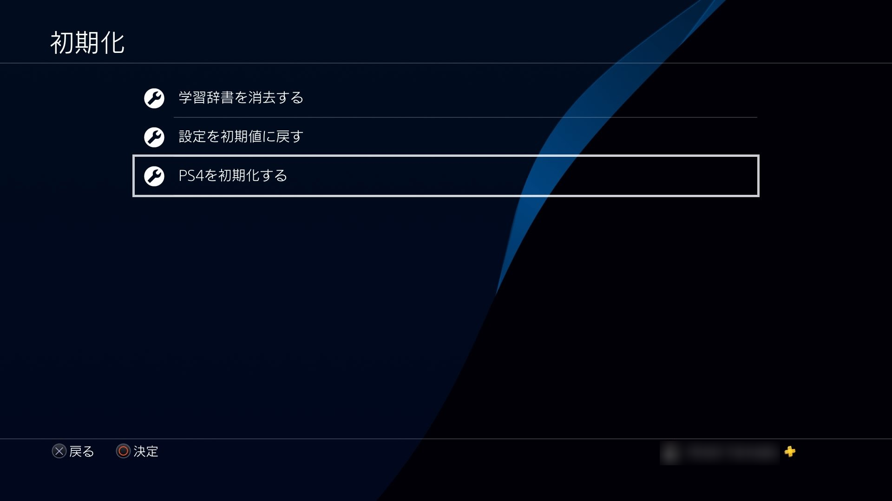
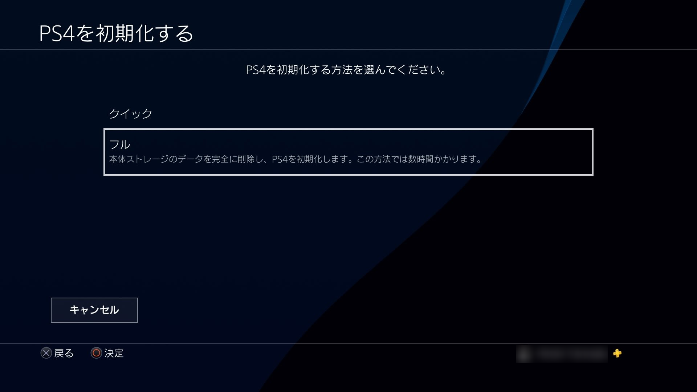
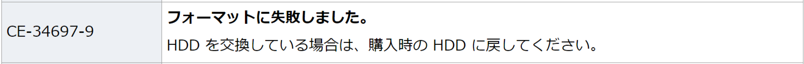
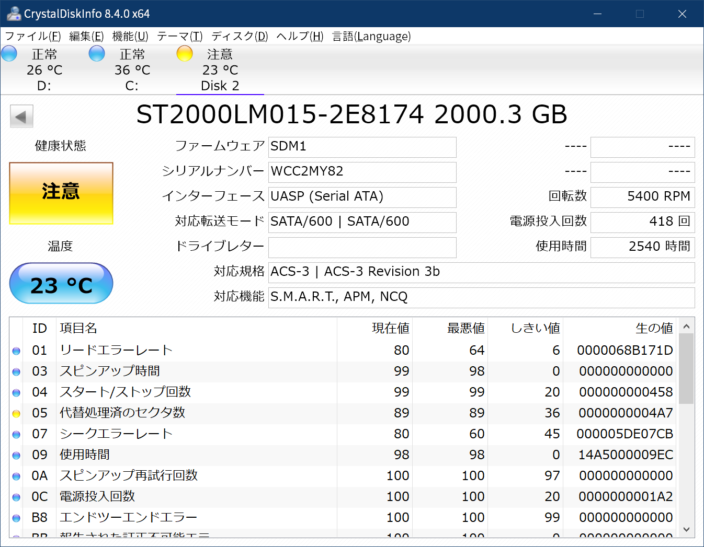
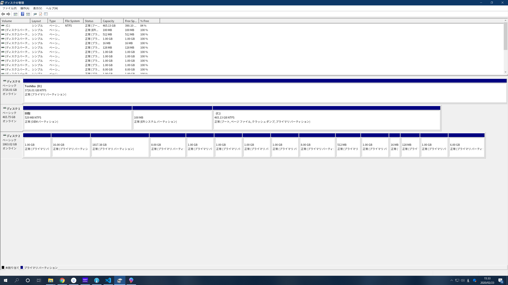
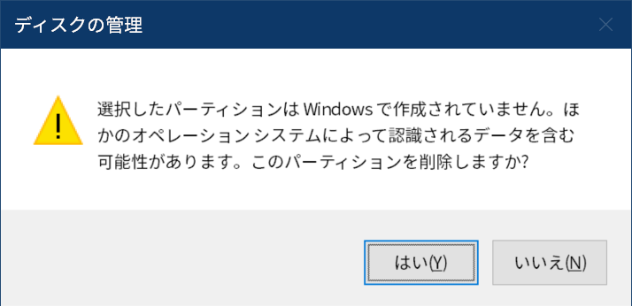
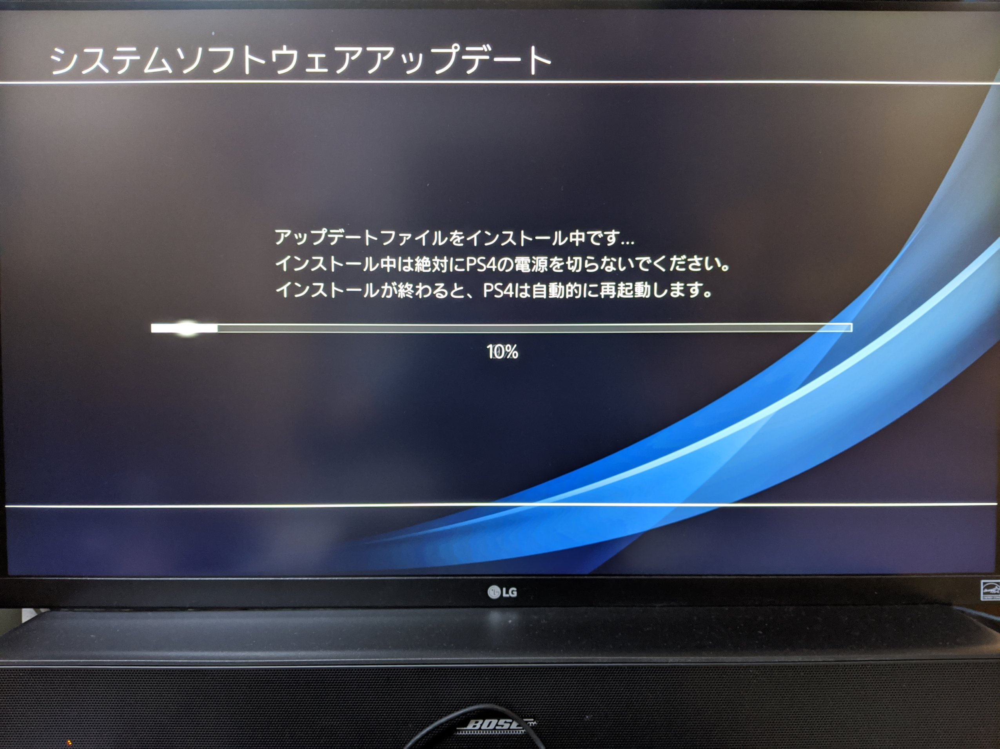
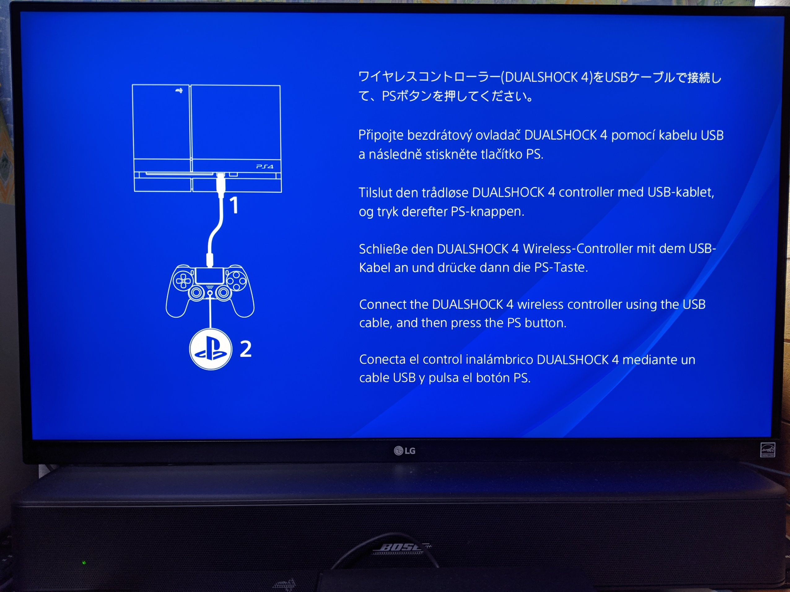

# PS4初期化の作業手順

## 概要

PlayStation 4 (PS4)を初期化したときの手順のメモ。

## スペック

PlayStation 4 (CUH-1100A[^1])
HDD: Seagate Barracuda 2TB ST2000LM015[^2]（2017/8に換装）

[^1]: [PlayStation 4 - Sony](https://www.jp.playstation.com/ps4/hardware/cuh1100ab01.html)
[^2]: [Seagate 2TB - Amazon](https://www.amazon.co.jp/gp/product/B01MA3J236/)

## 作業手順

### 本体のアップデート

初期化するときも最新版にアップデートしておいたほうが
何かとトラブルに遭わなくて済むことが多いので一応アップデート。

PS4を起動したらバージョン7.02のアップデートが降ってきたので、画面の指示にしたがって再起動。

### ファイルのバックアップ

セーブデータもスクリーンショットもPS Plusに加入しているならアップロードされているので必要なし。
スクリーンショットだけUSBにバックアップした。

`[ストレージ] > [本体ストレージ] > [すべて] > [USBストレージ機器にコピーする]`からバックアップ。

### 初期化

`[設定] > [初期化] > [PS4を初期化する] > [フル]`で初期化開始。







初期化開始時に表示されていた時間は4時間。

### 初期化に失敗

初期化してみると以下のメッセージ。

```txt
初期化できませんでした。
(CE-33563-0)
```

PS4のエラーコード一覧[^3]には記載されていないコードだった。
画面に書いてあること以上のことはないので一覧に無くても大した問題ではない。

[^3]: [PS4のエラーコード一覧 - Sony](https://support.asia.playstation.com/jajp/s/article/ans-jajp50400)

「OK」を選択（これしか選択できない）するとセーフモードで起動。
以下の選択肢が与えられた。

```txt
1. PS4を再起動する
2. 解像度を変更する
3. システムソフトウェアをアップデートする
4. 設定を初期値に戻す
5. データベースを再構築する
6. PS4を初期化する
7. PS4を初期化する(システムソフトウェアを再インストールする)
```


`1. ~ 5.`は明らかにどうでもいいのでとりあえず`6.`を選択。
もちろん初期化できず。エラーコードは「**CE-34697-9**」に変わる。

このエラーコードは[エラーコード一覧](https://support.asia.playstation.com/jajp/s/article/ans-jajp50400#CE-34697-9)によると
「**フォーマットに失敗しました。**
HDDを交換している場合は、購入時のHDDに戻してください。」らしい。


今更500GBのHDDに戻す選択をするつもりはないので無視。

### さらに悪化

`6.`では直らなかったので`7.`を選択。
バージョン7.02のシステムソフトウェアが必要と言われたので
Sonyのサイト[^4]からアップデートファイル（再インストール用）をUSBに入れて続行。

[^4]: [システムソフトウェアアップデート - Sony](https://www.jp.playstation.com/ps4/system-update/#ud-03-c)

`7.`以外の選択肢がグレーアウトして選べなくなる。


再度`7.`を選んでも結局エラーが出て初期化できない。
とりあえず通常の手段では初期化できそうにないことは理解した。

### HDDのフォーマット

HDDを購入時と同じ状態にすれば良いのではないかと考えた。
というわけで、HDDをPS4から取り出してPCでフォーマット。

まずはディスクの状態の確認。定番のCrystalDiskInfoでHDDの状態を確認。



「代替処理済のセクター数」の項目が原因で「注意」が出ていた。
あまりにも値が増えるようであればフォーマットが必要かもしれない。[^5][^6]
> 「生の値」は16進数で表記。10進数で1191個。

[^5]: [SMART情報と不良セクタ - PCと解](https://pctrouble.net/storage/smart_badsector.html)
[^6]: [「代替処理保留中のセクター数」で警告が出たHDDの修復テスト - ぼくんちのTV別館](https://freesoft.tvbok.com/tips/hdd-data/pending_sector_count.html)

セーブデータはクラウドにバックアップされているため
最悪PS4のHDDはぶっ壊れても大した問題ではないので作業を続行。

完全フォーマットは時間がかかって面倒なので、
「ディスクの管理」画面から1つずつパーティションを消すという超適当フォーマットを行なった。


▲「**ディスク2**」が今回該当するHDD

削除時には以下のような警告画面がでる。


パーティションをすべて削除して、ディスクをPCから取り外してPS4に再び装着。

### ふたたび初期化

前述の作業ですべてデータを削除しているので
USB内のアップデートファイルを使ってシステムの再構築。

何事もなくインストールが終わる。



### おわり

初回起動時の画面が現れたので初期化終了。

